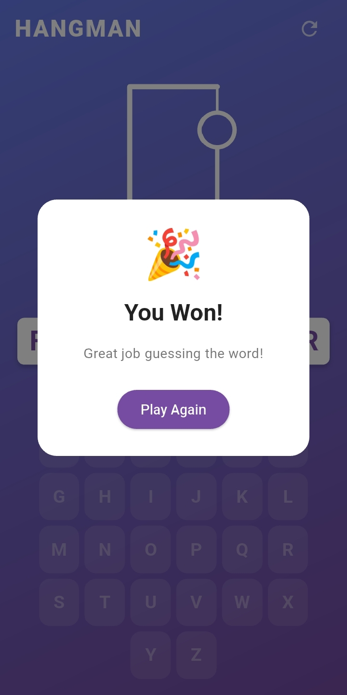
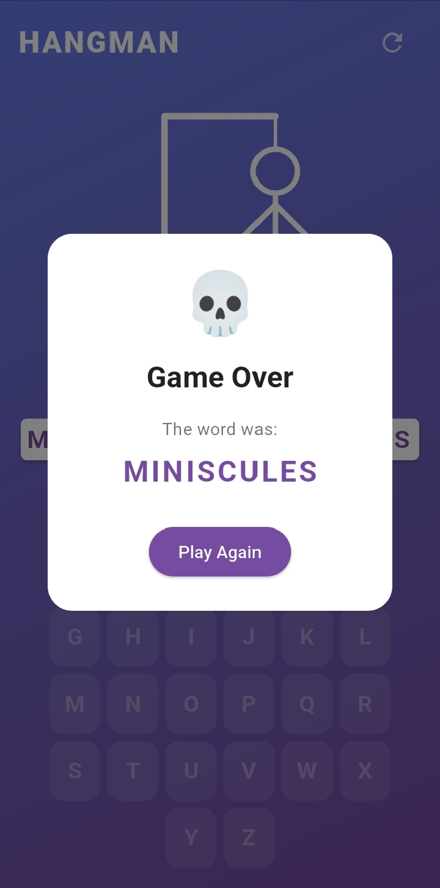
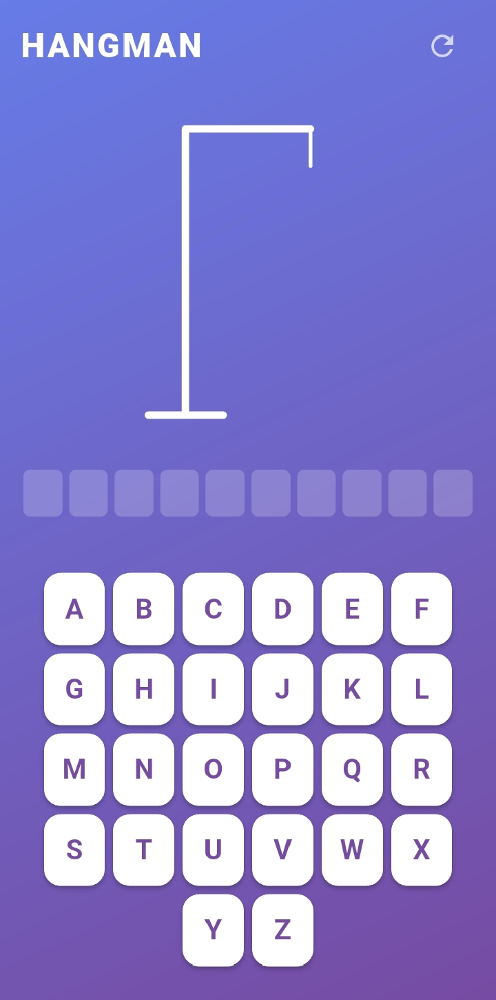

# Hangman Game

A classic Hangman game built with Flutter.

## Description

This is a simple implementation of the classic Hangman game using the Flutter framework. The player tries to guess a hidden word by suggesting letters within a certain number of attempts.

## Screenshots

| Winning | Losing | Gameplay |
|---|---|---|
|  |  |  |

## Features

*   Classic Hangman gameplay
*   Clean and simple user interface
*   Random word generation via an API
*   Visual feedback for correct and incorrect guesses
*   Display of remaining attempts

## Getting Started

### Prerequisites

*   Flutter SDK: [https://flutter.dev/docs/get-started/install](https://flutter.dev/docs/get-started/install)
*   Dart SDK: Included with Flutter

### Installation

1.  Clone the repository:
    ```bash
    git clone https://github.com/your-username/hangman_game.git
    ```
2.  Navigate to the project directory:
    ```bash
    cd hangman_game
    ```
3.  Install the dependencies:
    ```bash
    flutter pub get
    ```

## Usage

Run the application using the following command:

```bash
flutter run
```

## Folder Structure

The project follows the standard Flutter project structure:

```
hangman_game/
├── android/
├── ios/
├── lib/
│   ├── controllers/
│   │   └── hangman_controller.dart
│   ├── models/
│   │   └── game_status.dart
│   ├── views/
│   │   ├── hangman_screen.dart
│   │   └── widgets/
│   │       ├── hangman_painter.dart
│   │       ├── keyboard.dart
│   │       └── word_display.dart
│   └── main.dart
├── test/
└── pubspec.yaml
```

*   `lib/controllers`: Contains the business logic of the game.
*   `lib/models`: Defines the data structures for the game.
*   `lib/views`: Contains the UI components of the game.
*   `lib/main.dart`: The entry point of the application.

## Dependencies

*   `flutter`: The core Flutter framework.
*   `cupertino_icons`: Provides iOS-style icons.
*   `http`: For making HTTP requests (if an online word API is used).
*   `provider`: For state management.

## License

This project is licensed under the MIT License - see the [LICENSE](LICENSE) file for details.
